# 파이프라인 실행 예시

**유저 프롬프트**: "세 변의 길이가 6, 8, 10인 직각삼각형 내부에 모든 변과 접하고 있는 반지름 2인 내접원"

---

## 전체 흐름

```mermaid
flowchart TD
    UP["유저 프롬프트<br/>세 변의 길이가 6, 8, 10인 직각삼각형<br/>내부에 모든 변과 접하고 있는 반지름 2인 내접원"]

    subgraph P1["Phase 1 — LLM 호출"]
        P1_IN["입력<br/>• 시스템 프롬프트: Phase 1 규칙<br/>• 유저 메시지: 유저 프롬프트 원본"]
        P1_THINK["LLM 사고<br/>직각삼각형 → geometry-2d<br/>내접원 → geometry-2d<br/>프롬프트에 없는 것: 외접원, 수선, 각도 표시"]
        P1_OUT["출력 JSON<br/>modules: geometry-2d<br/>renderList: 7개 요소"]
        P1_IN --> P1_THINK --> P1_OUT
    end

    UP --> P1_IN

    subgraph P2["Phase 2 — LLM 호출"]
        P2_IN["입력<br/>• 시스템 프롬프트: Phase 2 규칙 + geometry-2d 수학 규칙<br/>• 유저 메시지: Phase 1 JSON (유저 프롬프트 없음)"]
        P2_THINK["LLM 사고 (자연어 추론)<br/>꼭짓점 좌표 계산, 내심 좌표 계산,<br/>접점 좌표 계산, 교차 검증"]
        P2_OUT["출력 JSON<br/>points + elements + boundingBox<br/>(수학 좌표계)"]
        P2_IN --> P2_THINK --> P2_OUT
    end

    P1_OUT -->|"renderList<br/>(유저 프롬프트 제거됨)"| P2_IN

    subgraph VL["검증 + 변환 레이어 — 프로그래밍적"]
        VL_V["검증<br/>• renderId 유효성<br/>• dist&#40;I, 각 변&#41; == 2 확인<br/>• 참조 무결성"]
        VL_T["변환<br/>• 수학 좌표 → SVG 좌표<br/>• scale, offset, viewBox 계산<br/>• 원 반지름 px 변환"]
        VL_OUT["SVG 좌표 JSON"]
        VL_V --> VL_T --> VL_OUT
    end

    P2_OUT --> VL_V

    subgraph P3["Phase 3 — LLM 호출"]
        P3_IN["입력<br/>• 시스템 프롬프트: Phase 3 규칙 + 디자인 가이드<br/>• 유저 메시지: renderList + SVG 좌표 JSON"]
        P3_THINK["LLM 코드 조립<br/>요소별 순차 생성<br/>(좌표 계산 없음, 숫자 대입만)"]
        P3_OUT["최종 HTML/SVG 코드"]
        P3_IN --> P3_THINK --> P3_OUT
    end

    VL_OUT --> P3_IN
    P1_OUT -->|"renderList"| P3_IN

    style P1 fill:#e8f4fd,stroke:#2563eb
    style P2 fill:#f0fdf4,stroke:#16a34a
    style VL fill:#fefce8,stroke:#ca8a04
    style P3 fill:#fdf2f8,stroke:#db2777
```



---

## Phase 1 — 요소 정의 + 모듈 선택

### 입력

**시스템 프롬프트**: Phase 1 전용 규칙 (모듈 목록, 포함/배제 판단 기준)

**유저 메시지**: `세 변의 길이가 6, 8, 10인 직각삼각형 내부에 모든 변과 접하고 있는 반지름 2인 내접원`

### LLM 사고 과정

```
프롬프트 분석:
- 직각삼각형: 세 변 6, 8, 10 → 도형
- 내접원: 반지름 2, 모든 변에 접함 → 원
- 꼭짓점 라벨: "삼각형"이므로 A, B, C 라벨은 필수 구성 요소
- 직각: "직각삼각형"이므로 직각 기호는 필수 구성 요소

프롬프트에 없는 것 (제외):
- 외접원 → 언급 없음
- 각도 표시 → 언급 없음
- 변의 길이 수치 라벨 → 언급 없음
- 접점 라벨 → 언급 없음
- 수선, 중선 → 언급 없음
```

### 출력 JSON

```json
{
  "modules": ["geometry-2d"],
  "renderList": [
    {
      "id": 1,
      "element": "직각삼각형 ABC",
      "type": "polygon",
      "description": "세 변의 길이가 6, 8, 10인 직각삼각형, 빗변 10"
    },
    {
      "id": 2,
      "element": "내접원",
      "type": "circle",
      "description": "삼각형 내부에 모든 변과 접하는 원, 반지름 2"
    },
    {
      "id": 3,
      "element": "꼭짓점 라벨 A",
      "type": "label",
      "value": "A"
    },
    {
      "id": 4,
      "element": "꼭짓점 라벨 B",
      "type": "label",
      "value": "B"
    },
    {
      "id": 5,
      "element": "꼭짓점 라벨 C",
      "type": "label",
      "value": "C"
    },
    {
      "id": 6,
      "element": "내접원 중심점",
      "type": "point",
      "description": "내접원의 중심"
    },
    {
      "id": 7,
      "element": "직각 기호",
      "type": "right-angle-mark",
      "description": "직각 꼭짓점에 ㄱ자 기호"
    }
  ]
}
```

> **이 시점 이후, 유저 프롬프트 원본은 파이프라인에서 제거된다.**

---

## Phase 2 — 수학적 좌표 계산

### 입력

**시스템 프롬프트**: Phase 2 공통 규칙 + geometry-2d 수학 규칙

**유저 메시지**: Phase 1 출력 JSON (위의 JSON 그대로. 유저 프롬프트 원본 없음.)

### LLM 사고 과정 (자연어 추론)

```
직각삼각형 세 변: 6, 8, 10
10이 빗변 → 직각은 6과 8이 만나는 꼭짓점

꼭짓점 배치:
  직각 꼭짓점 C를 원점에 배치
  C = (0, 0)
  B = (8, 0)  — 밑변 8
  A = (0, 6)  — 높이 6

검증:
  |AB| = √(64 + 36) = √100 = 10 ✓
  |BC| = 8 ✓
  |CA| = 6 ✓

내접원:
  a = BC = 8, b = CA = 6, c = AB = 10
  반둘레 s = (6 + 8 + 10) / 2 = 12
  내접원 반지름 r = 넓이 / s = (6×8/2) / 12 = 24 / 12 = 2 ✓ (프롬프트와 일치)

  내심 좌표:
  Ix = (a·Ax + b·Bx + c·Cx) / (a+b+c) = (8·0 + 6·8 + 10·0) / 24 = 48/24 = 2
  Iy = (a·Ay + b·By + c·Cy) / (a+b+c) = (8·6 + 6·0 + 10·0) / 24 = 48/24 = 2
  I = (2, 2)

교차 검증:
  I에서 변 BC(y=0)까지 거리: 2 = r ✓
  I에서 변 CA(x=0)까지 거리: 2 = r ✓
  I에서 변 AB까지 거리:
    AB 직선: 3x + 4y - 24 = 0
    거리 = |3·2 + 4·2 - 24| / 5 = |6+8-24| / 5 = 10/5 = 2 = r ✓
```

### 출력

```
(위의 자연어 추론)

---JSON_OUTPUT---
```

```json
{
  "coordinateSystem": "cartesian-y-up",
  "points": {
    "A": [0, 6],
    "B": [8, 0],
    "C": [0, 0],
    "I": [2, 2]
  },
  "elements": [
    {
      "renderId": 1,
      "type": "polygon",
      "vertices": ["C", "B", "A"]
    },
    {
      "renderId": 2,
      "type": "circle",
      "center": "I",
      "radius": 2
    },
    {
      "renderId": 3,
      "type": "label",
      "text": "A",
      "anchor": "A",
      "offset": "above-left"
    },
    {
      "renderId": 4,
      "type": "label",
      "text": "B",
      "anchor": "B",
      "offset": "below-right"
    },
    {
      "renderId": 5,
      "type": "label",
      "text": "C",
      "anchor": "C",
      "offset": "below-left"
    },
    {
      "renderId": 6,
      "type": "point",
      "at": "I"
    },
    {
      "renderId": 7,
      "type": "right-angle-mark",
      "vertex": "C",
      "toward1": "B",
      "toward2": "A",
      "size": 0.8
    }
  ],
  "boundingBox": {
    "xMin": -1.5, "xMax": 9.5, "yMin": -1.5, "yMax": 7.5
  }
}
```

---

## 검증 + 변환 레이어 — 프로그래밍적

### 검증

```
[renderId 유효성]  renderList id 1~7 ↔ elements renderId 1~7: 전체 매칭 ✓
[points 참조]      elements에서 참조하는 A,B,C,I 모두 points에 존재 ✓
[boundingBox]      xMin(-1.5) < xMax(9.5), yMin(-1.5) < yMax(7.5) ✓

[geometry-2d 원 검증]
  dist(I, 변 BC) = dist((2,2), y=0) = 2 == radius ✓
  dist(I, 변 CA) = dist((2,2), x=0) = 2 == radius ✓
  dist(I, 변 AB) = |3·2 + 4·2 - 24| / 5 = 10/5 = 2 == radius ✓

→ 검증 통과
```

### 변환

```
boundingBox: { xMin: -1.5, xMax: 9.5, yMin: -1.5, yMax: 7.5 }
contentWidth = 11, contentHeight = 9

scale = min(560/11, 400/9) = min(50.9, 44.4) = 44

viewBox 중앙 정렬:
  originX = 340 - ((9.5 + -1.5) / 2) * 44 = 340 - 176 = 164
  originY = (7.5 * 44) + 40 = 370
  viewBoxH = round(contentHeight * 44 + 80) = 476

좌표 변환:
  toSVG(mathX, mathY) = (originX + mathX * scale, originY - mathY * scale)

  A(0, 6)  → (164 + 0,   370 - 264) = (164, 106)
  B(8, 0)  → (164 + 352, 370 - 0)   = (516, 370)
  C(0, 0)  → (164 + 0,   370 - 0)   = (164, 370)
  I(2, 2)  → (164 + 88,  370 - 88)  = (252, 282)

내접원 반지름: 2 * 44 = 88px
직각 기호 크기: 0.8 * 44 ≈ 35px
```

### 변환 레이어 출력 → Phase 3 입력

```json
{
  "viewBox": "0 0 680 476",
  "svgPoints": {
    "A": [164, 106],
    "B": [516, 370],
    "C": [164, 370],
    "I": [252, 282]
  },
  "svgElements": [
    {
      "renderId": 1,
      "type": "polygon",
      "points": "164,370 516,370 164,106"
    },
    {
      "renderId": 2,
      "type": "circle",
      "cx": 252, "cy": 282, "r": 88
    },
    {
      "renderId": 3,
      "type": "label",
      "text": "A", "x": 152, "y": 90
    },
    {
      "renderId": 4,
      "type": "label",
      "text": "B", "x": 530, "y": 384
    },
    {
      "renderId": 5,
      "type": "label",
      "text": "C", "x": 148, "y": 384
    },
    {
      "renderId": 6,
      "type": "point",
      "cx": 252, "cy": 282, "r": 3.5
    },
    {
      "renderId": 7,
      "type": "right-angle-mark",
      "d": "M199 370 L199 335 L164 335"
    }
  ]
}
```

> **모든 좌표가 SVG 좌표로 변환 완료. Phase 3은 수학 계산을 하지 않는다.**

---

## Phase 3 — SVG 코드 생성

### 입력

**시스템 프롬프트**: Phase 3 코드 생성 규칙 + 디자인 가이드

**유저 메시지**: Phase 1의 renderList + 변환 레이어 출력 JSON

### LLM 코드 조립 (요소별 순차)

```
--- ELEMENT 1 (직각삼각형 ABC) ---
polygon, points="164,370 516,370 164,106"
→ 채움 + 외곽선

--- ELEMENT 2 (내접원) ---
circle, cx=252, cy=282, r=88
→ 채움 + 외곽선

--- ELEMENT 7 (직각 기호) ---
path, d="M199 370 L199 335 L164 335"
→ z-order: 도형 위, 라벨 아래

--- ELEMENT 6 (내접원 중심점) ---
circle, cx=252, cy=282, r=3.5
→ 채움 점

--- ELEMENT 3 (라벨 A) ---
text, x=152, y=90, "A"

--- ELEMENT 4 (라벨 B) ---
text, x=530, y=384, "B"

--- ELEMENT 5 (라벨 C) ---
text, x=148, y=384, "C"

--- FINAL ---
```

### 최종 출력 코드

```html
<svg id="vis" width="100%" viewBox="0 0 680 476" xmlns="http://www.w3.org/2000/svg">
  <defs></defs>
</svg>
<script>
  const svg = document.getElementById('vis');
  const ns = 'http://www.w3.org/2000/svg';

  function el(tag, attrs) {
    const e = document.createElementNS(ns, tag);
    for (const [k, v] of Object.entries(attrs)) e.setAttribute(k, v);
    return e;
  }

  // ELEMENT 1: 직각삼각형 ABC
  svg.appendChild(el('polygon', {
    points: '164,370 516,370 164,106',
    fill: '#dbeafe',
    'fill-opacity': '0.3',
    stroke: '#2563eb',
    'stroke-width': '1.5',
    'stroke-linejoin': 'round'
  }));

  // ELEMENT 2: 내접원
  svg.appendChild(el('circle', {
    cx: '252', cy: '282', r: '88',
    fill: '#fef3c7',
    'fill-opacity': '0.25',
    stroke: '#f59e0b',
    'stroke-width': '1.5'
  }));

  // ELEMENT 7: 직각 기호
  svg.appendChild(el('path', {
    d: 'M199 370 L199 335 L164 335',
    fill: 'none',
    stroke: '#64748b',
    'stroke-width': '0.8'
  }));

  // ELEMENT 6: 내접원 중심점
  svg.appendChild(el('circle', {
    cx: '252', cy: '282', r: '3.5',
    fill: '#374151'
  }));

  // ELEMENT 3: 꼭짓점 라벨 A
  const tA = el('text', {
    x: '152', y: '90',
    'font-size': '14', 'font-weight': '500',
    'text-anchor': 'middle', 'dominant-baseline': 'central',
    fill: '#1e293b'
  });
  tA.textContent = 'A';
  svg.appendChild(tA);

  // ELEMENT 4: 꼭짓점 라벨 B
  const tB = el('text', {
    x: '530', y: '384',
    'font-size': '14', 'font-weight': '500',
    'text-anchor': 'middle', 'dominant-baseline': 'central',
    fill: '#1e293b'
  });
  tB.textContent = 'B';
  svg.appendChild(tB);

  // ELEMENT 5: 꼭짓점 라벨 C
  const tC = el('text', {
    x: '148', y: '384',
    'font-size': '14', 'font-weight': '500',
    'text-anchor': 'middle', 'dominant-baseline': 'central',
    fill: '#1e293b'
  });
  tC.textContent = 'C';
  svg.appendChild(tC);
</script>
```

---

## 각 Phase에서 LLM이 하는 일과 하지 않는 일

| | Phase 1 | Phase 2 | 변환 레이어 | Phase 3 |
|---|---|---|---|---|
| 유저 프롬프트 해석 | **O** | X | X | X |
| 요소 포함/배제 판단 | **O** | X | X | X |
| 수학 좌표 계산 | X | **O** | X | X |
| 교차 검증 (자기 검증) | X | **O** | X | X |
| 좌표 정합성 검증 | X | X | **O** | X |
| 수학→SVG 좌표 변환 | X | X | **O** | X |
| scale, viewBox 계산 | X | X | **O** | X |
| SVG 코드 생성 | X | X | X | **O** |
| 스타일 적용 | X | X | X | **O** |
