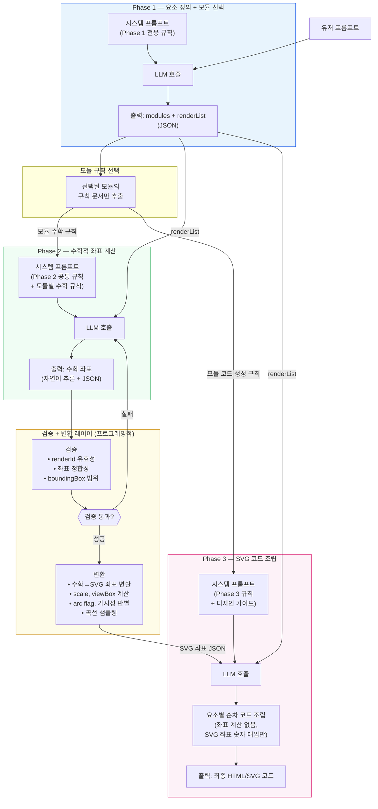

# 수학적 시각화 코드 생성 파이프라인 명세

## 1. 배경 및 문제 정의

### 1.1 기존 방식과 한계

기존에는 단일 시스템 프롬프트(v5, 약 1,050줄)를 LLM에 전달하고, 하나의 LLM 호출에서 최종 HTML/SVG 코드를 생성하는 방식을 사용했다. v5 시스템 프롬프트에는 이미 다음과 같은 규칙들이 명시되어 있다.

- **프롬프트 충실도 원칙 (2절)**: "사용자 프롬프트에 명시되지 않은 요소를 추가하지 않는다"
- **배제 원칙 (2.2절)**: 구체적인 예시까지 포함하여 추가 금지 대상을 명시
- **프롬프트 해석 절차 (2.3절)**: 코드 생성 전에 렌더링 대상 요소를 목록으로 추출하라는 단계별 절차
- **계산 선행 원칙 (7.1절)**: 모든 좌표를 공식으로 계산하고 교차 검증하라는 규칙
- **수학적 정확성 체크리스트 (11절)**: 기하, 좌표평면, 3D, 전개도, 통계 등 영역별 검증 항목

**그럼에도 불구하고 문제가 반복되는 이유:**

**1. 규칙 과부하와 강제 수단의 부재.** 1,050줄의 프롬프트에는 기하 도형, 함수 그래프, 3D 투영, Chart.js, 전개도, 미적분, 확률 등 모든 시각화 유형의 규칙이 포함되어 있다. 삼각형 하나를 그릴 때에도 LLM은 Chart.js 규칙과 리만합 규칙을 함께 본다. 개별 규칙에 할당되는 주의력이 희석되고, 코드 생성이라는 복잡한 작업에 돌입하면 규칙 준수보다 코드 완성에 주의력이 집중된다. 2.3절에서 "코드 생성 전에 렌더링 목록을 추출하라"고 지시했지만, LLM은 이 단계를 건너뛰고 바로 코드 작성을 시작할 수 있으며, 이를 강제할 수단이 없다.

**2. 관심사의 동시 처리.** 하나의 LLM 호출에서 5가지 관심사를 동시에 만족시켜야 한다: (1) 무엇을 그릴지 판단, (2) 수학적 좌표 계산, (3) 수학 좌표 → SVG 좌표 변환, (4) 뷰포트 레이아웃, (5) 스타일 적용. 이 중 하나에 집중하면 다른 것의 품질이 떨어진다. 예를 들어, 전개도의 unfolding 알고리즘에 집중하면 스타일 규칙(접히는 변은 점선)을 누락하고, SVG 좌표 변환에 집중하면 수학적 관계(공유 변 좌표 일치)를 깨뜨린다.

**3. 중간 결과의 검증 불가.** 단일 호출 방식에서는 LLM의 사고 과정과 중간 계산 결과를 외부에서 확인할 수 없다. 좌표 계산이 틀렸는지, 렌더링 목록에서 불필요한 요소를 추가했는지를 최종 코드가 나온 뒤에야 알 수 있으며, 그때는 이미 모든 오류가 코드에 녹아들어 있다.

**결론**: 규칙의 내용이 부족한 것이 아니라, **하나의 호출에서 모든 규칙을 동시에 지키게 하는 구조 자체가 한계**다. 규칙을 더 추가하거나 정교하게 다듬어도 이 구조적 문제는 해결되지 않는다.

### 1.2 전환 방향

단일 호출 구조를 **3단계(Phase) 파이프라인**으로 분리한다. 각 Phase는 하나의 관심사만 처리하며, 이전 Phase의 출력이 다음 Phase의 입력 제약이 된다.

- **Phase 1**: 무엇을 그릴 것인가 (요소 정의 + 모듈 선택)
- **Phase 2**: 수학적으로 어디에 위치하는가 (좌표 계산)
- **Phase 3**: SVG 코드로 어떻게 렌더링하는가 (코드 생성)

추가로, Phase 2와 Phase 3 사이에 **프로그래밍적 검증 + 변환 레이어**를 둔다.

---

## 2. 파이프라인 요약

### 2.1 Phase별 역할


| Phase       | 역할            | LLM 호출      | 입력                                              | 출력                              |
| ----------- | ------------- | ----------- | ----------------------------------------------- | ------------------------------- |
| **Phase 1** | 요소 정의 + 모듈 선택 | 1회          | 유저 프롬프트                                         | `modules` + `renderList` (JSON) |
| **Phase 2** | 수학적 좌표 계산     | 1회          | Phase 1 JSON                                    | 수학 좌표 (JSON)                    |
| **검증 + 변환 레이어**  | 검증 + 수학→SVG 좌표 변환 | 0회 (프로그래밍적) | Phase 2 JSON                                    | 검증 결과 + SVG 좌표 JSON                |
| **Phase 3** | SVG 코드 조립     | 1회          | Phase 1 renderList + SVG 좌표 JSON + 디자인 가이드 | 최종 HTML/SVG 코드                  |


### 2.2 핵심 설계 원칙

1. **유저 프롬프트 격리**: Phase 1만 유저 프롬프트 원본을 받는다. Phase 2, 3은 유저 프롬프트를 직접 보지 않는다. 이를 통해 LLM이 프롬프트에 없는 요소를 자의적으로 추가하는 문제를 구조적으로 차단한다.
2. **관심사 분리**: 각 Phase는 하나의 관심사만 처리한다. Phase 2는 SVG를 모르고, Phase 3은 수학 계산을 하지 않는다.
3. **모듈별 프롬프트 경량화**: Phase 1에서 선택된 모듈에 해당하는 규칙만 후속 Phase에 주입한다. 1,050줄 전체가 아닌, 해당 모듈의 100~200줄만 전달한다.
4. **구조적 바인딩**: Phase 2의 출력 JSON은 Phase 1의 `renderList`에 `renderId`로 바인딩된다. renderList에 없는 요소는 출력에 포함될 수 없으며, 포함되더라도 프로그래밍적으로 검출/제거된다.
5. **단계 간 검증 + 변환**: Phase 2와 Phase 3 사이에 프로그래밍적 레이어를 두어, 수학적 정합성을 코드 레벨에서 확인하고, 수학 좌표를 SVG 좌표로 변환한다. 이를 통해 Phase 3에서 좌표 변환(y축 반전, scale, arc flag 등)을 수행할 필요가 없다.

### 2.3 모듈 체계

Phase 1에서 유저 프롬프트를 분석하여 아래 6개 모듈 중 적절한 모듈을 1개 이상 선택한다. 선택된 모듈의 규칙 문서만 Phase 2, 3에 주입된다.


| 모듈            | 대상                              | 핵심 인프라             |
| ------------- | ------------------------------- | ------------------ |
| `functions`   | 좌표평면 위의 함수 그래프, 부등식 영역          | 좌표축, y축 반전, 곡선 샘플링 |
| `geometry-2d` | 2D 평면 도형, 원, 다각형, 전개도           | 자유 캔버스, 등축 스케일     |
| `geometry-3d` | 3D 입체도형 (기둥, 뿔, 구)              | 투영 함수, 가시성 판별      |
| `tables`      | 도수분포표, 줄기-잎그림, 데이터 표            | 격자 구조, 텍스트 정렬      |
| `charts`      | 통계 차트 (히스토그램, 막대, 원, 박스플롯, 산점도) | Chart.js           |
| `diagrams`    | 벤다이어그램, 연산 다이어그램, 수직선(부등식)      | 구조적 레이아웃           |


---

## 3. 파이프라인 흐름도




---

## 4. Phase 1 — 요소 정의 + 모듈 선택

### 4.1 목적

유저 프롬프트를 분석하여 **무엇을 렌더링할 것인가**를 확정하고, 적절한 모듈을 선택한다. 이 Phase의 출력이 이후 전체 파이프라인의 범위를 결정한다.

### 4.2 입력


| 항목       | 설명                                                   |
| -------- | ---------------------------------------------------- |
| 시스템 프롬프트 | Phase 1 전용 규칙 (모듈 목록, renderList 작성 규칙, 포함/배제 판단 기준) |
| 유저 메시지   | 유저 프롬프트 원본                                           |


**Phase 1 시스템 프롬프트 구성 (요약)**:

```
당신은 수학 시각화 요소 분석기입니다.

유저 프롬프트를 분석하여:
1. 적절한 모듈을 선택하라 (1개 이상)
2. 렌더링할 요소 목록을 추출하라

사용 가능한 모듈:
- functions: 좌표평면 위의 함수 그래프, 부등식 영역
- geometry-2d: 2D 평면 도형, 원, 다각형, 전개도
- geometry-3d: 3D 입체도형 (기둥, 뿔, 구)
- tables: 도수분포표, 줄기-잎그림, 데이터 표
- charts: 통계 차트 (히스토그램, 막대, 원, 박스플롯, 산점도)
- diagrams: 벤다이어그램, 연산 다이어그램, 수직선

규칙:
- 프롬프트에 명시된 요소만 renderList에 포함한다.
- 프롬프트에 없는 요소는 포함하지 않는다.
- 도형의 필수 구성 요소(꼭짓점 라벨, 좌표축 등)는 포함한다.
- 각 요소의 description에 수치와 수학적 조건을 포함한다.
```

### 4.3 출력 (JSON)

```json
{
  "modules": ["geometry-2d"],
  "renderList": [
    {
      "id": 1,
      "element": "활꼴 영역",
      "type": "filled-region",
      "description": "반지름 8인 원에서 현 길이 8인 호와 현으로 둘러싸인 영역"
    },
    {
      "id": 2,
      "element": "호",
      "type": "arc",
      "description": "반지름 8인 원의 호, 현 길이 8에 대응하는 단호"
    },
    {
      "id": 3,
      "element": "현",
      "type": "line-segment",
      "description": "길이 8"
    },
    {
      "id": 4,
      "element": "중심점 O",
      "type": "point"
    },
    {
      "id": 5,
      "element": "반지름 선분",
      "type": "line-segment",
      "description": "O에서 호의 한 끝점까지, 길이 8"
    },
    {
      "id": 6,
      "element": "반지름 수치",
      "type": "label",
      "value": "8"
    },
    {
      "id": 7,
      "element": "현 길이 수치",
      "type": "label",
      "value": "8"
    }
  ]
}
```

**renderList 항목의 필드**:


| 필드            | 필수  | 설명                                                                                                                                                               |
| ------------- | --- | ---------------------------------------------------------------------------------------------------------------------------------------------------------------- |
| `id`          | O   | 고유 식별자. 이후 Phase에서 `renderId`로 참조됨                                                                                                                               |
| `element`     | O   | 요소 이름 (한글)                                                                                                                                                       |
| `type`        | O   | 요소 유형 (`point`, `line-segment`, `arc`, `polygon`, `circle`, `filled-region`, `curve`, `axes`, `label`, `solid`, `net-face`, `table`, `chart-bindable`, `venn` 등) |
| `description` | -   | 수치와 수학적 조건. Phase 2의 좌표 계산에 필요한 정보                                                                                                                               |
| `value`       | -   | label 타입인 경우, 표시할 텍스트                                                                                                                                            |


### 4.4 핵심 역할

- **유저 프롬프트와 이후 Phase 사이의 유일한 접점**. Phase 2, 3은 유저 프롬프트 원본을 직접 보지 않는다.
- renderList에 포함되지 않은 요소는 Phase 2에서 좌표가 계산되지 않고, Phase 3에서 코드가 생성되지 않는다.
- 모듈 선택 결과에 따라 Phase 2, 3에 주입되는 규칙 문서가 결정된다.

---

## 5. Phase 2 — 수학적 좌표 계산

### 5.1 목적

Phase 1의 renderList에 정의된 요소들의 **수학적 좌표와 관계를 계산**한다. 이 Phase는 SVG, 픽셀, 화면 배치를 일절 고려하지 않으며, 순수 수학 좌표계에서만 사고한다.

### 5.2 입력


| 항목       | 설명                                        |
| -------- | ----------------------------------------- |
| 시스템 프롬프트 | Phase 2 공통 규칙 + 선택된 모듈의 수학 규칙 문서          |
| 유저 메시지   | Phase 1 출력 JSON (**유저 프롬프트 원본은 포함하지 않음**) |


**Phase 2 시스템 프롬프트 구성 (요약)**:

```
당신은 수학 좌표 계산 전문가입니다.
renderList에 정의된 요소들의 수학적 좌표를 계산합니다.

규칙:
- 모든 좌표는 수학 좌표계(y축 위로 증가)로 계산한다.
- SVG, 픽셀, 화면 배치는 고려하지 않는다.
- 좌표를 추정하지 않는다. 공식으로 계산한다.
- 계산 후 교차 검증을 수행한다.
- 출력 JSON의 elements에는 renderList의 id에 대응하는 renderId만 포함한다.
  renderList에 없는 요소를 추가하지 않는다.
- 자연어로 추론한 뒤, ---JSON_OUTPUT--- 구분자 이후에 JSON을 출력한다.

{모듈별 수학 규칙 문서}
```

### 5.3 출력

자연어 추론(Chain of Thought) + `---JSON_OUTPUT---` 구분자 + JSON.

**자연어 추론 부분** (예시):

```
반지름 R=8, 현의 길이 c=8
반현 = 4
sin(θ/2) = 4/8 = 0.5 → θ/2 = π/6 → θ = π/3 (60°)
중심에서 현까지 거리 d = √(64-16) = √48 = 4√3 ≈ 6.928

현을 수평 배치, 현의 중점을 원점에 놓으면:
  A = (-4, 0), B = (4, 0)
  O = (0, 4√3) (현 위쪽)

호: O에서 A까지 각도 = atan2(-6.928, -4) ≈ 240°
    O에서 B까지 각도 = atan2(-6.928, 4) ≈ 300°
    호는 A(240°)에서 B(300°)까지의 단호 (60°, 현 아래로 불룩)

검증:
  dist(O, A) = √(16+48) = 8 = R ✓
  dist(O, B) = √(16+48) = 8 = R ✓
  |AB| = 8 = c ✓
  호 최저점 y = 6.928 - 8 = -1.072 (현 아래) ✓
```

**JSON 부분**: 공통 최소 구조를 따르며, 요소 내부 필드는 자유 형식이다. 단, 검증 + 변환 레이어가 파싱할 수 있도록 핵심 타입에 대해서는 필수 필드를 약속한다.

### 5.4 Phase 2 출력 JSON 규칙

#### 공통 최소 구조 (필수)

```json
{
  "coordinateSystem": "cartesian-y-up",
  "points": {
    "이름": [x, y]
  },
  "elements": [
    {
      "renderId": 1,
      "type": "...",
      "...자유 필드"
    }
  ],
  "boundingBox": {
    "xMin": 0, "xMax": 0, "yMin": 0, "yMax": 0
  }
}
```

| 필드 | 설명 |
| --- | --- |
| `coordinateSystem` | 좌표계 유형. `"cartesian-y-up"` (2D), `"3d-right-hand"` (3D) |
| `points` | 모든 명명된 점의 좌표. 다른 요소에서 이름으로 참조 |
| `elements` | renderList의 각 항목에 대응. `renderId`로 연결 |
| `boundingBox` | 라벨 포함 전체 영역. 검증 + 변환 레이어의 뷰포트 계산에 사용 |

#### 타입별 필수 필드 (검증 + 변환 레이어가 필요로 하는 최소 필드)

| type | 필수 필드 | 용도 |
| --- | --- | --- |
| `circle` | `center` (점 이름), `radius` (숫자) | 좌표 변환, 거리 검증 |
| `arc` | `center` (점 이름), `radius` (숫자), `startDeg` (숫자), `endDeg` (숫자) | SVG arc flag 계산 |
| `polygon` | `vertices` (점 이름 배열) | 좌표 변환 |
| `net-face` | `faceId`, `vertices` (점 이름 배열), `sharedEdge` (있는 경우) | 공유 변 검증 |
| `curve` | `functionId` (함수 참조) | 곡선 샘플링 |
| `solid` | `faces` (면 id 배열) | 투영, 가시성 판별 |

그 외 필드(label의 offset, anchor 표현 등)는 자유롭게 기술한다.

#### functions 모듈 추가 필드

`functions` 모듈인 경우, 최상위에 아래 필드를 포함한다:

```json
{
  "axisConfig": {
    "xRange": [-4, 4],
    "yRange": [-2, 5],
    "tickInterval": { "x": 1, "y": 1 }
  },
  "functions": [
    {
      "id": "f1",
      "expression": "y = -x² + 4",
      "jsBody": "return -x*x + 4;",
      "domain": [-3, 3],
      "discontinuities": []
    }
  ]
}
```

`jsBody`는 변환 레이어가 곡선 샘플링을 수행할 때 사용한다. LLM이 샘플링 코드를 작성하지 않으므로, 함수식만 정확하면 된다.

#### geometry-3d 모듈 추가 필드

`geometry-3d` 모듈인 경우, `points` 대신 `points3d`를 사용하고, `faces`와 `edges`를 포함한다:

```json
{
  "coordinateSystem": "3d-right-hand",
  "points3d": {
    "A": [0, 0, 0],
    "B": [4, 0, 0]
  },
  "faces": [
    { "id": "bottom", "vertices": ["A", "B", "C"], "normal": [0, 0, -1] }
  ],
  "edges": [
    { "from": "A", "to": "B", "adjacentFaces": ["bottom", "front"] }
  ],
  "boundingBox3d": {
    "xMin": 0, "xMax": 4, "yMin": 0, "yMax": 3.464, "zMin": 0, "zMax": 6
  }
}
```

Phase 2는 3D 좌표와 면 법선만 출력한다. **투영 변환과 가시성 판별은 검증 + 변환 레이어에서 프로그래밍적으로 수행**한다.

#### 전개도 추가 필드

전개도의 경우, `faces`와 `sharedEdge`를 포함한다:

```json
{
  "faces": [
    { "id": "bottom", "vertices": ["A", "B", "C"] },
    {
      "id": "side1",
      "vertices": ["A", "B", "E", "D"],
      "sharedEdge": { "with": "bottom", "points": ["A", "B"] }
    }
  ]
}
```

`sharedEdge`를 통해 검증 레이어가 공유 변 좌표 일치를 프로그래밍적으로 확인한다.

---

## 6. 검증 + 변환 레이어 (Phase 2 → Phase 3)

### 6.1 목적

Phase 2의 JSON 출력을 **검증**한 뒤, 수학 좌표를 **SVG 좌표로 변환**하여 Phase 3에 전달한다. 이 레이어는 LLM이 아닌 **사전 작성된 프로그램 코드**로 동작한다.

이 레이어의 핵심 가치: 좌표 변환, arc flag 계산, 3D 투영, 가시성 판별, 곡선 샘플링 등의 **알고리즘적 작업을 LLM이 아닌 검증된 코드가 수행**한다. LLM이 매번 새로 작성하면서 발생하는 알고리즘 오류가 원천 제거된다.

### 6.2 검증 항목

#### 6.2.1 공통 검증

| 검증 | 설명 |
| --- | --- |
| `renderId` 유효성 | 출력 JSON의 모든 `renderId`가 Phase 1의 renderList `id`에 존재하는지 확인. 존재하지 않는 `renderId`는 제거. |
| `renderId` 완전성 | renderList의 모든 `id`에 대응하는 element가 출력에 존재하는지 확인. |
| `boundingBox` 유효성 | `xMin < xMax`, `yMin < yMax` |
| `points` 참조 무결성 | elements에서 참조하는 point 이름이 `points`에 모두 존재하는지 확인 |

#### 6.2.2 모듈별 검증

| 모듈 | 검증 항목 |
| --- | --- |
| `geometry-2d` (전개도) | 공유 변 좌표 일치, 공유 변 길이 일치, 면 비겹침 |
| `geometry-2d` (원/호) | 점-원 거리 = 반지름, 호 각도 범위 유효성 |
| `geometry-3d` | 면 법선과 꼭짓점 순서 외적 일관성, 모서리 인접 면 공유 여부 |
| `functions` | `jsBody` 실행 가능 여부, 특수점이 함수 위에 있는지 (f(x) = y) |

### 6.3 변환 항목

검증을 통과한 Phase 2 JSON을 SVG 좌표 JSON으로 변환한다.

#### 6.3.1 공통 변환 함수

| 함수 | 입력 | 출력 | 설명 |
| --- | --- | --- | --- |
| `computeViewport` | boundingBox, padding | scale, offset, viewBoxHeight | 뷰포트 파라미터 계산 |
| `toSVG` | mathX, mathY, scale, offset | svgX, svgY | 수학→SVG 좌표 변환 (y축 반전 포함) |
| `transformAllPoints` | points, scale, offset | svgPoints | 모든 명명된 점을 일괄 변환 |

#### 6.3.2 모듈별 변환 함수

| 모듈 | 함수 | 설명 |
| --- | --- | --- |
| `geometry-2d` | `arcToSVGPath` | startDeg/endDeg → SVG path 명령어 + arc flag 계산 |
| `geometry-2d` | `validateSharedEdges` | 전개도 공유 변 좌표 정합성 검증 |
| `functions` | `sampleCurve` | jsBody를 실행하여 곡선 샘플 포인트 생성 (1px 간격) |
| `functions` | `detectDiscontinuity` | 불연속점 검출 및 polyline 분리 |
| `geometry-3d` | `project3D` | 3D 좌표 → 2D 투영 좌표 변환 |
| `geometry-3d` | `computeFaceVisibility` | 면 법선 · 시선 벡터 내적으로 앞면/뒷면 판별 |
| `geometry-3d` | `classifyEdges` | 인접 면 가시성 기반 모서리 visible/hidden 분류 |

#### 6.3.3 변환 레이어 출력 (Phase 3 입력)

변환 레이어는 Phase 3에 **SVG 좌표 JSON**을 전달한다. Phase 3은 이 데이터를 받아 숫자를 SVG 문법에 대입만 한다.

```json
{
  "viewBox": "0 0 680 460",
  "svgPoints": {
    "A": [180, 280],
    "B": [500, 280],
    "O": [340, 3]
  },
  "svgElements": [
    {
      "renderId": 2,
      "type": "arc",
      "d": "M180 280 A320 320 0 0 0 500 280",
      "cx": 340, "cy": 3, "r": 320
    },
    {
      "renderId": 3,
      "type": "line-segment",
      "x1": 180, "y1": 280, "x2": 500, "y2": 280
    }
  ]
}
```

arc의 `d` 속성(SVG path 명령어)이 변환 레이어에서 이미 생성되어 있으므로, Phase 3의 LLM은 arc flag를 판단할 필요가 없다.

### 6.4 검증 실패 시 처리

검증 실패 시, 실패 항목과 사유를 포함하여 Phase 2를 재호출한다. 최대 재시도 횟수를 설정한다 (예: 2회).

---

## 7. Phase 3 — SVG 코드 조립

### 7.1 목적

Phase 1의 renderList와 검증 + 변환 레이어가 출력한 **SVG 좌표 JSON**을 받아, **최종 HTML/SVG 코드를 조립**한다. 이 Phase는 수학 계산과 좌표 변환을 하지 않으며, 주어진 SVG 좌표를 SVG 문법에 대입하고 디자인 가이드에 따라 스타일을 적용하는 것에만 집중한다.

### 7.2 입력

| 항목 | 설명 |
| --- | --- |
| 시스템 프롬프트 | Phase 3 코드 조립 규칙 + 모듈별 코드 생성 규칙 + 디자인 가이드 |
| 유저 메시지 | Phase 1의 `renderList` + 검증 + 변환 레이어의 SVG 좌표 JSON |

**Phase 3 시스템 프롬프트 구성 (요약)**:

```
당신은 SVG 코드 조립 전문가입니다.
주어진 SVG 좌표를 SVG 코드로 조립하여 최종 HTML을 생성합니다.

규칙:
- renderList에 정의된 요소만 코드에 포함한다.
- SVG 좌표 JSON에 포함된 좌표와 속성값을 그대로 사용한다.
  좌표를 재계산하거나 변환하지 않는다.
- renderList의 요소를 하나씩 순차적으로 SVG 코드를 생성한 뒤,
  최종 HTML로 조립한다.

{모듈별 코드 생성 규칙}
{디자인 가이드}
```

### 7.3 내부 단계

#### Phase 3-A: 요소별 순차 코드 생성

renderList의 각 요소를 순서대로 처리한다. 한 번에 전체 코드를 생성하는 것이 아니라, **요소 하나씩** SVG 코드를 생성한다. 각 요소의 SVG 좌표는 변환 레이어에서 이미 계산되어 있으므로, LLM은 숫자를 SVG 문법에 대입하고 디자인 가이드에 따라 스타일 속성을 추가한다.

```
--- ELEMENT 1 (활꼴 영역) ---
<path d="M180 280 A320 320 0 0 0 500 280 Z" fill="..." fill-opacity="0.25"/>
--- END ---

--- ELEMENT 2 (호) ---
<path d="M180 280 A320 320 0 0 0 500 280" stroke="..." stroke-width="1.5" fill="none"/>
--- END ---

--- ELEMENT 3 (현) ---
<line x1="180" y1="280" x2="500" y2="280" stroke="..." stroke-width="1.5"/>
--- END ---

...
```

이 구조의 이점:

- LLM이 한 번에 하나의 요소에만 집중한다.
- renderList에 없는 요소가 추가될 수 없다 (목록 순회 구조).
- 각 요소의 코드가 독립적으로 검증 가능하다.

#### Phase 3-B: 최종 HTML 조립

위에서 생성한 코드 조각들을 SVG 컨테이너 안에 z-order에 맞게 조립한다.

```
--- FINAL ---
<svg id="vis" width="100%" viewBox="0 0 680 420" xmlns="http://www.w3.org/2000/svg">
  <defs>...</defs>
</svg>
<script>
  const svg = document.getElementById('vis');
  const ns = 'http://www.w3.org/2000/svg';
  // 요소별 코드 조립
</script>
--- END ---
```

### 7.4 Phase 3에서 LLM이 하는 일과 하지 않는 일

| 하는 일 | 하지 않는 일 |
| --- | --- |
| SVG 좌표를 SVG 문법에 대입 | 수학 좌표 계산 |
| 디자인 가이드에 따라 스타일 속성 적용 | 수학→SVG 좌표 변환 (y축 반전, scale) |
| z-order에 맞게 요소 정렬 | arc flag 판별 |
| 최종 HTML 구조 조립 | 3D 투영, 가시성 판별 |
| | 곡선 샘플링 |

### 7.5 출력

최종 HTML/SVG 코드 (문자열).

---

## 8. 기대 효과

### 8.1 문제별 개선 예상


| 기존 문제 | 해결 단계 | 해결 방식 | 개선 수준 |
| --- | --- | --- | --- |
| 불필요한 요소 추가 | Phase 1 | renderList로 범위 확정 + 유저 프롬프트 격리 | 높음 |
| 수학적 좌표 오류 | Phase 2 + 검증 레이어 | 수학 계산에만 집중 + 교차 검증 + 프로그래밍적 검증 | 높음 |
| SVG 변환 오류 (arc flag 등) | 변환 레이어 | 사전 작성 코드가 arc flag, y축 반전 등을 결정적으로 계산 | 높음 |
| 입체도형 실선/점선 오류 | 변환 레이어 | 사전 작성 코드가 가시성 판별 수행, Phase 3은 결과만 적용 | 높음 |
| 이차함수 직선 렌더링 | 변환 레이어 | 사전 작성 코드가 jsBody를 실행하여 샘플 포인트 생성 | 높음 |
| 전개도 면 분리 | Phase 2 + 검증 레이어 | 공유 변 좌표 명시 + 프로그래밍적 좌표 일치 검증 | 높음 |
| 레이아웃 오류 (잘림, 치우침) | 변환 레이어 | 사전 작성 코드가 boundingBox 기반 뷰포트 계산 수행 | 높음 |
| 스타일 미준수 | Phase 3 | 디자인 가이드에만 집중, 수학/변환 부담 없음 | 중간 |
| 규칙 과부하 (1,050줄) | 전체 | 모듈별 경량화, Phase별 필요 규칙만 주입 | 높음 |


### 8.2 구조적 이점

1. **프로그래밍적 검증 가능**: Phase 간 데이터가 JSON으로 구조화되어 있으므로, 코드 레벨의 자동 검증이 가능하다. 기존 단일 호출 방식에서는 중간 결과를 검증할 수 없었다.
2. **모듈 확장 용이**: 새로운 시각화 유형이 추가되면 해당 모듈 문서만 작성하면 된다. 기존 모듈에 영향을 주지 않는다.
3. **디버깅 용이**: 결과물에 문제가 있을 때, Phase 1 출력(요소 정의), Phase 2 출력(좌표), Phase 3 출력(코드)을 단계별로 확인하여 어느 Phase에서 오류가 발생했는지 특정할 수 있다.
4. **디자인 가이드 분리**: Phase 3에만 디자인 가이드를 주입하므로, 디자인 변경 시 Phase 1, 2에 영향이 없다. 디자인 가이드를 독립적으로 개발/수정할 수 있다.

### 8.3 기존 asset_function 대비 포지셔닝


| 항목      | asset_function (기존) | 단일 LLM 코드 생성 (현재) | 3-Phase 파이프라인 (전환 목표) |
| ------- | ------------------- | ----------------- | --------------------- |
| 정확성     | 높음                  | 낮음                | 높음 (목표)               |
| 유연성     | 스키마에 제한됨            | 무제한               | 무제한                   |
| 새 도형 추가 | 렌더러 개발 필요           | 프롬프트 수정만          | 모듈 문서 추가/수정만          |
| 디버깅     | 렌더러 코드 확인           | 불투명 (단일 출력)       | 단계별 JSON 확인           |
| LLM 비용  | 1회 호출               | 1회 호출             | 3회 호출                 |


