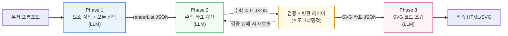

# 수학적 시각화 코드 생성 — 파이프라인 전환 계획 (요약)

## 현재 문제

단일 시스템 프롬프트(v5, 1,050줄)로 LLM을 1회 호출하여 최종 코드를 생성하는 방식. 프롬프트 내에 "불필요한 요소를 추가하지 마라", "좌표를 공식으로 계산하고 검증하라" 등의 규칙이 이미 존재하지만, 다음 구조적 한계로 인해 문제가 반복됨.

1. **규칙 과부하**: 1,050줄의 규칙을 한번에 주입하면 LLM 주의력이 분산되고, 규칙 준수를 강제할 수단이 없음
2. **관심사의 동시 처리**: 무엇을 그릴지 / 수학 계산 / SVG 변환 / 레이아웃 / 스타일을 하나의 호출에서 동시에 처리
3. **중간 결과 검증 불가**: 좌표 계산이 틀렸는지, 불필요한 요소가 추가됐는지를 최종 코드가 나온 뒤에야 확인 가능

## 전환 방향

단일 호출 → **3-Phase 파이프라인 + 검증/변환 레이어**로 분리.

| Phase           | 역할                                  | 관심사                 |
| --------------- | ------------------------------------- | ---------------------- |
| **Phase 1**     | 무엇을 그릴지 정의 + 6개 모듈 중 선택 | "무엇을"               |
| **Phase 2**     | 수학 좌표 계산 (SVG를 모름)           | "어디에"               |
| **검증 + 변환** | 좌표 검증 + 수학→SVG 좌표 변환        | 알고리즘적 정확성 보장 |
| **Phase 3**     | SVG 좌표를 코드에 대입 + 스타일 적용  | "어떻게"               |

## 핵심 설계 원칙

- **유저 프롬프트 격리**: Phase 1만 유저 프롬프트를 받음. Phase 2, 3은 구조화된 JSON만 받으므로, LLM이 프롬프트에 없는 요소를 자의적으로 추가하는 문제를 구조적으로 차단.
- **모듈별 경량화**: Phase 1에서 선택된 모듈의 규칙만 후속 Phase에 주입. 1,050줄 → 100~200줄로 축소.
- **검증 + 변환 레이어**: arc flag, y축 반전, 3D 투영, 가시성 판별, 곡선 샘플링 등의 알고리즘적 작업을 사전 작성된 코드가 수행. LLM이 매번 새로 작성하면서 발생하는 오류 원천 제거.

## 6개 모듈

| 모듈          | 대상                                              |
| ------------- | ------------------------------------------------- |
| `functions`   | 함수 그래프, 부등식 영역                          |
| `geometry-2d` | 2D 도형, 원, 전개도                               |
| `geometry-3d` | 3D 입체도형                                       |
| `tables`      | 도수분포표, 줄기-잎그림                           |
| `charts`      | 히스토그램, 막대, 원, 박스플롯, 산점도 (Chart.js) |
| `diagrams`    | 벤다이어그램, 연산 다이어그램, 수직선             |

## 기대 효과

| 항목         | asset_function (기존) | 단일 LLM 호출 (현재) | 3-Phase 파이프라인 (목표) |
| ------------ | --------------------- | -------------------- | ------------------------- |
| 정확성       | 높음                  | 낮음                 | **높음**                  |
| 유연성       | 스키마에 제한됨       | 무제한               | **무제한**                |
| 새 도형 추가 | 렌더러 개발 필요      | 프롬프트 수정만      | **모듈 문서 추가/수정만** |
| 디버깅       | 렌더러 코드 확인      | 불투명               | **단계별 JSON 확인**      |
| LLM 비용     | 1회 호출              | 1회 호출             | 3회 호출                  |
